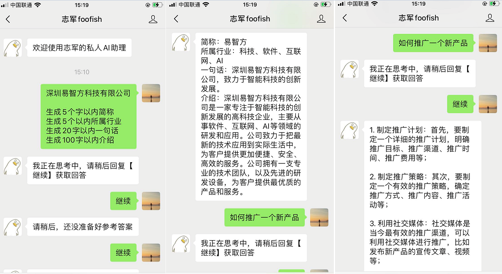

# 基于公众号的chatgpt


### 技术栈
* Flask：  web框架
* wsgi server： gunicorn

### 前置操作

1. 安装 python3.8以上版本
2. 安装依赖文件 pip install -r requirements.txt


### 本地开发

1、在项目根目录创建 `.env`文件 ，主要放置敏感数据，比如数据库配置，密钥等数据，内容：

```
WECHAT_APPID=公众号APPID
WECHAT_SECRET=公众号密钥
OPENAI_KEY=chatpgt的openapi key
REDIS_PASSWORD=Redis密码
```

正式环境中请将配置项放置在环境变量中


2、启动

```
flask run
```

运行效果

