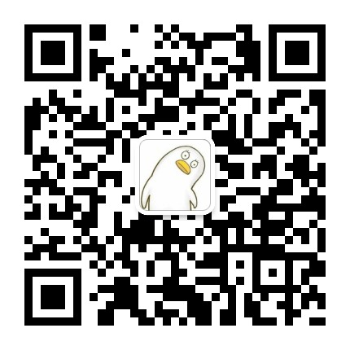

# 基于公众号的chatgpt

该项目可以让你在公众号实现与chatgpt的对话

### 技术栈
* web框架：Flask  
* wsgi server： gunicorn

### 前置操作

1. 安装 python3.8以上版本
2. 安装依赖文件 
```commandline
pip install -r requirements.txt

```


### 本地开发

1、在项目根目录创建 `.env`文件 ，主要放置敏感数据，比如数据库配置，密钥等数据，内容：

```
WECHAT_APPID=公众号APPID
WECHAT_SECRET=公众号密钥
OPENAI_KEY=chatpgt的openapi key
REDIS_PASSWORD=Redis密码
```

2、启动

```
flask run
```

正式环境中请将配置项放置在环境变量中，教程请参考文章：[我用Python写个公众号版chatgpt：打造私人AI助理](https://mp.weixin.qq.com/s/-zhfsvF6ENzMka7Wk6hyMA)


运行效果


### 体验地址

关注公众号【志军foofish】直接发起提问




### 联系我

微信：lzjun567

